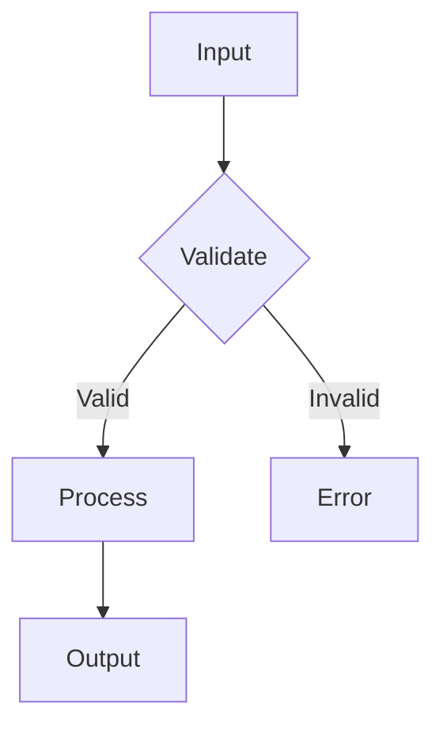
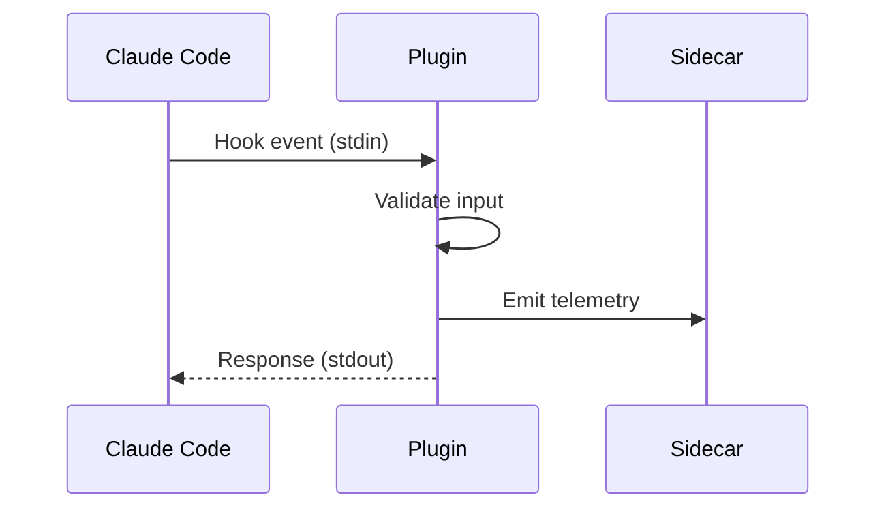
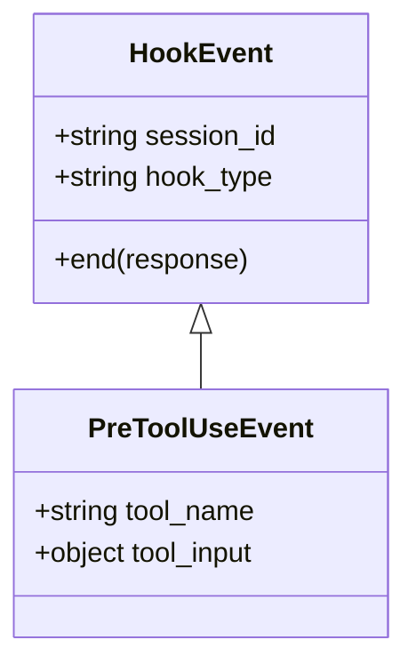
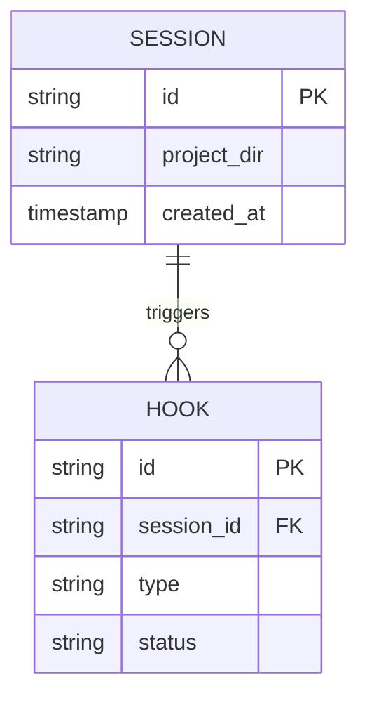
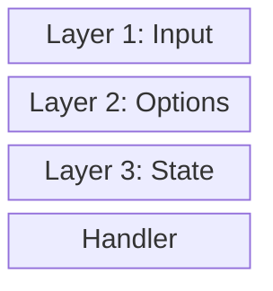
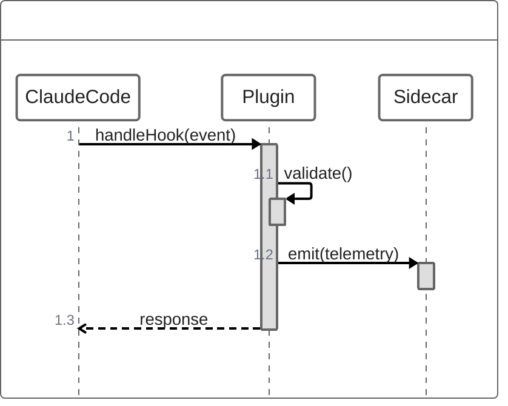

# Mermaid Diagram Types Reference

## Flowchart

Best for: Data flows, pipelines, decision trees, process flows.

**Reference:** <https://mermaid.js.org/syntax/flowchart.html>

**Direction options:** `TB` (top-bottom), `TD`, `BT`, `LR`, `RL`

**Node shapes:**

* `[text]` - Rectangle
* `(text)` - Rounded rectangle
* `{text}` - Diamond (decision)
* `([text])` - Stadium
* `[[text]]` - Subroutine
* `[(text)]` - Cylinder (database)

**Link styles:**

* `-->` - Arrow
* `---` - Line
* `-.->` - Dotted arrow
* `==>` - Thick arrow
* `--text-->` - Arrow with label

## Sequence Diagram

Best for: Hook execution order, API call sequences, message flows.

**Reference:** <https://mermaid.js.org/syntax/sequenceDiagram.html>

**Arrow types:**

* `->` - Solid line without arrow
* `-->` - Dotted line without arrow
* `->>` - Solid line with arrow
* `-->>` - Dotted line with arrow
* `-x` - Solid line with cross
* `--x` - Dotted line with cross

**Features:**

* `participant` - Define participants
* `Note over A,B: text` - Notes spanning participants
* `loop` / `end` - Loop blocks
* `alt` / `else` / `end` - Conditional blocks
* `activate` / `deactivate` - Activation boxes

## Class Diagram

Best for: Type relationships, class hierarchies, interface contracts.

**Reference:** <https://mermaid.js.org/syntax/classDiagram.html>

**Relationships:**

* `<|--` - Inheritance
* `*--` - Composition
* `o--` - Aggregation
* `-->` - Association
* `..>` - Dependency
* `..|>` - Realization (interface)

**Visibility:**

* `+` - Public
* `-` - Private
* `#` - Protected
* `~` - Package/Internal

## Entity Relationship Diagram

Best for: Data models, database schemas, state relationships.

**Reference:** <https://mermaid.js.org/syntax/entityRelationshipDiagram.html>

**Cardinality:**

* `||` - Exactly one
* `o|` - Zero or one
* `}|` - One or more
* `}o` - Zero or more

## Block Diagram

Best for: System architecture, component layouts, layered views.

**Reference:** <https://mermaid.js.org/syntax/block.html>

## ZenUML (Sequence Alternative)

Best for: Complex sequences with code-like syntax.

**Reference:** <https://mermaid.js.org/syntax/zenuml.html>

