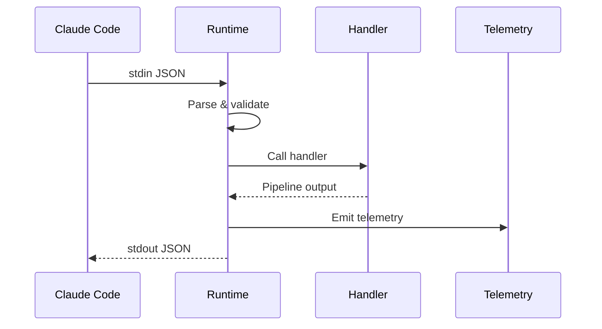
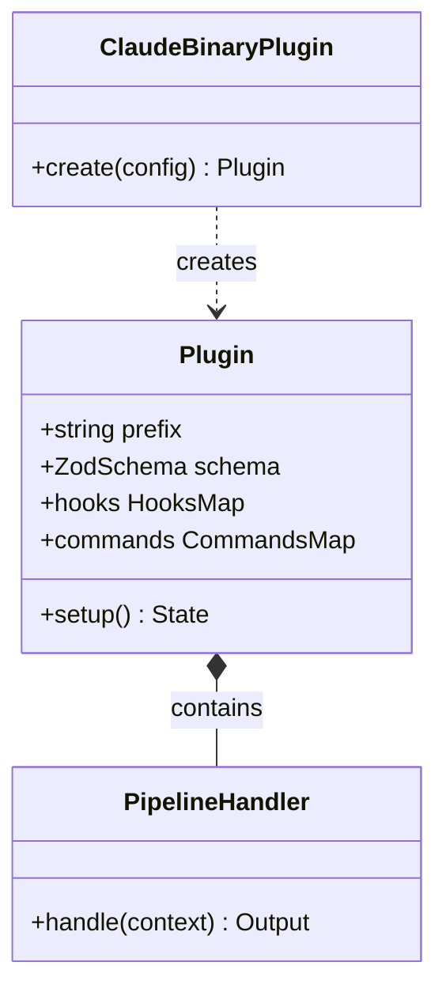
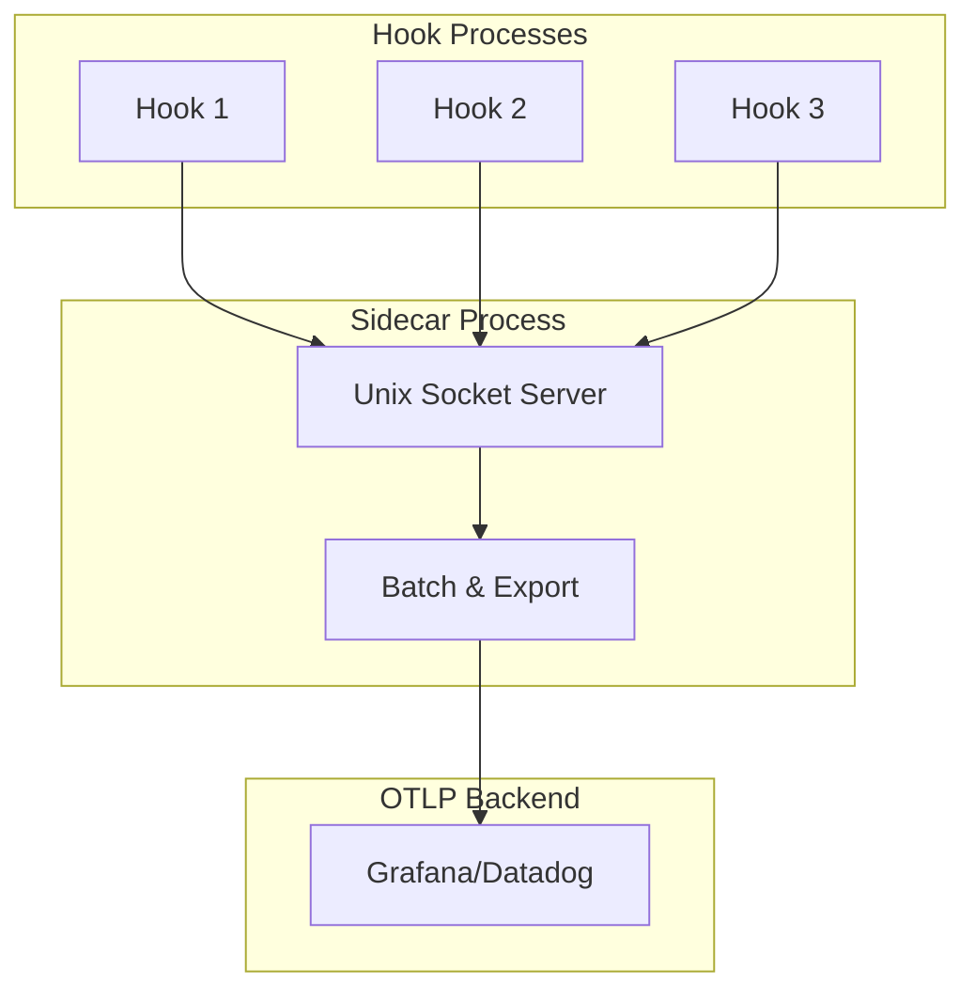
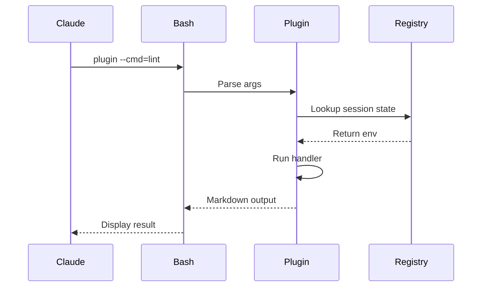

# SDK Documentation Mermaid Examples

## Three-Layer Model

```mermaid
flowchart TB
    subgraph L1["Layer 1: Input"]
        I[Claude Code stdin]
    end

    subgraph L2["Layer 2: Options"]
        O[Environment Variables]
    end

    subgraph L3["Layer 3: State"]
        S[setup&#40;&#41; computed]
    end

    subgraph H["Handler"]
        F["handler&#40;&#123; input, options, state &#125;&#41;"]
    end

    L1 --> L2 --> L3 --> H
```

## Hook Execution Flow

```mermaid
sequenceDiagram
    participant CC as Claude Code
    participant R as Runtime
    participant H as Handler
    participant T as Telemetry

    CC->>R: stdin JSON
    R->>R: Parse & validate
    R->>H: Call handler
    H-->>R: Pipeline output
    R->>T: Emit telemetry
    R-->>CC: stdout JSON
```

## Plugin Architecture

```mermaid
classDiagram
    class ClaudeBinaryPlugin {
        +create(config) Plugin
    }

    class Plugin {
        +string prefix
        +ZodSchema schema
        +setup() State
        +hooks HooksMap
        +commands CommandsMap
    }

    class PipelineHandler {
        +handle(context) Output
    }

    ClaudeBinaryPlugin ..> Plugin : creates
    Plugin *-- PipelineHandler : contains
```

## OTEL Sidecar Architecture

```mermaid
flowchart TB
    subgraph Hooks["Hook Processes"]
        H1[Hook 1]
        H2[Hook 2]
        H3[Hook 3]
    end

    subgraph Sidecar["Sidecar Process"]
        S[Unix Socket Server]
        B[Batch & Export]
    end

    subgraph Backend["OTLP Backend"]
        G[Grafana/Datadog]
    end

    H1 --> S
    H2 --> S
    H3 --> S
    S --> B --> G
```

## Command Execution Flow

```mermaid
sequenceDiagram
    participant C as Claude
    participant B as Bash
    participant P as Plugin
    participant R as Registry

    C->>B: plugin --cmd=lint
    B->>P: Parse args
    P->>R: Lookup session state
    R-->>P: Return env
    P->>P: Run handler
    P-->>B: Markdown output
    B-->>C: Display result
```
